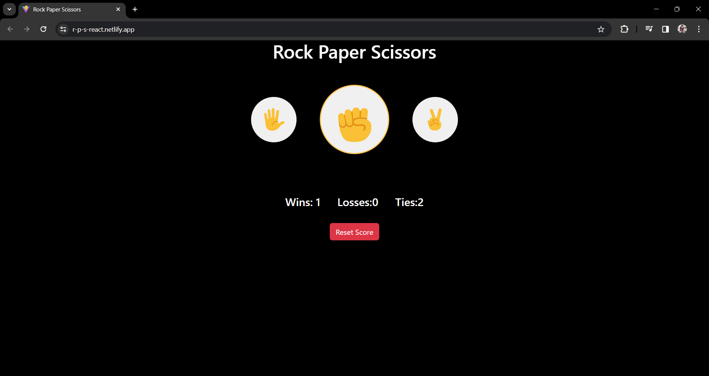
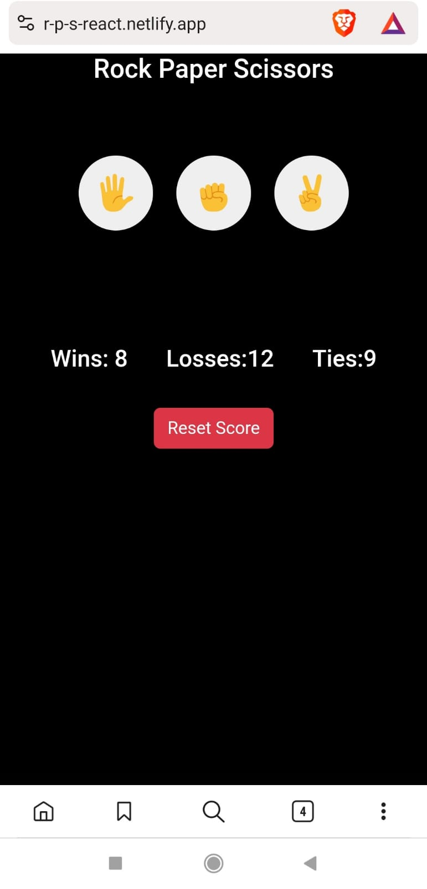
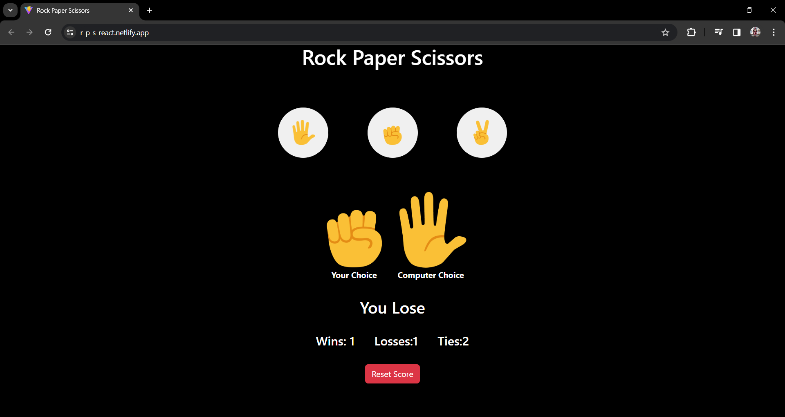
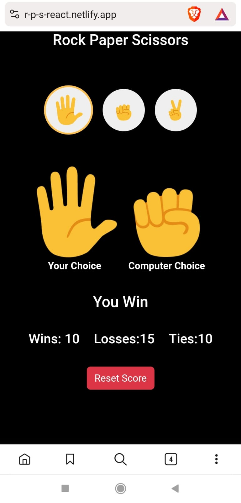

<div id="top"></div>

# React Rock, Paper, Scissors Game

<details>
<summary>Table of contents</summary>

-   [Overview](#overview)
-   [Technology Stack](#technology-stack)
-   [Getting Started](#getting-started)
-   [Features](#features)
-   [Screenshots](#screenshots)
-   [Link](#link)

</details>

## Overview

Welcome to the React Rock, Paper, Scissors Game! This project allows users to play the classic game against the computer, with scores tracked using local storage.

## Technology Stack

- React
- HTML
- CSS 
- JS

## Getting Started

1. Clone the repository:
   ```bash
   git clone https://github.com/hemanth110702/react-rps-game.git
   cd react-rps-game
   ```

2. Install dependencies:
   ```bash 
   npm install
   ```

3. Start the development server:
   ```bash
   npm run dev
   ```

## Features

- **Interactive Gameplay:** Enjoy an engaging game of Rock, Paper, Scissors against the computer.
- **Score Tracking:** Scores for wins, losses, and ties are persistently stored using local storage.
- **Responsive Design:** Ensures an optimal gaming experience across various devices.


## Screenshots

<table>
    <tr>
        <th>Desktop View</th>
        <th>Mobile View</th>
    </tr>
    <tr>
      <td colspan="3" style="text-align: left;font-weight: bold;">Home-page</td>
    </tr>
    <tr>
        <td>
            
        </td>
        <td>
            
        </td>
    </tr>
    <tr>
      <td colspan="3" style="text-align: left;font-weight: bold;">Result</td>
    </tr>
    <tr>
        <td>
            
        </td>
        <td>
            
        </td>
    </tr>
</table>

## Link
[🚀 Live Page](https://r-p-s-react.netlify.app/)

<p align="right"><a href="#top">⬆️ Back to Top</a></p>